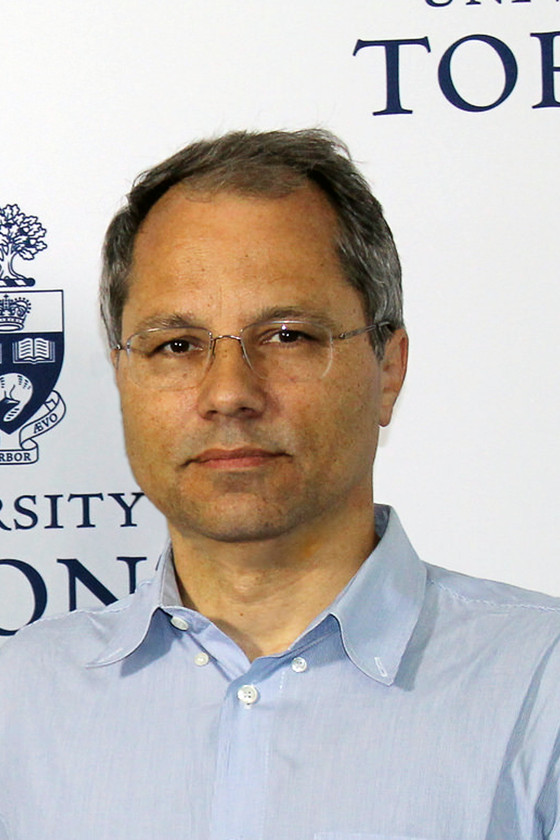

  
  

    <h1 style="margin: 0 0 8px 0;">Pawel Artymowicz</h1>
    

      Tenured Full Professor of Physics and Astrophysics, University of Toronto
    

    

      <strong>Departments:</strong> Physical & Environmental Sciences (UTSC) & Astronomy & Astrophysics (St. George)
    

    

      <strong>Office:</strong> SW 504B / Physical Sciences | <strong>Tel:</strong> (+1) 416-287-7244 | <strong>Cell:</strong> (+1) 416-358-4275
    

    

      <a class="btn btn-outline-primary btn-sm" href="http://planets.utsc.utoronto.ca/~pawel/" target="_blank">Planets Home</a>
      <a class="btn btn-outline-secondary btn-sm" href="mailto:pawel@utsc.utoronto.ca">Email (pawel@utsc.utoronto.ca)</a>
      <a class="btn btn-outline-info btn-sm" href="https://scholar.google.com/citations?user=KxR7XlQAAAAJ" target="_blank">Google Scholar (8000+ Cites, h=37)</a>
      <a class="btn btn-outline-dark btn-sm" href="http://planets.utsc.utoronto.ca/~pawel/progD57/" target="_blank">Code Repository</a>
    

  

---

# Curriculum Vitae of Pawel Artymowicz

## (i) Personal Data and Contact Information

- **Name**: Pawel Artymowicz
- **Marital status**: Married, 2 children
- **Languages**: Polish, English, German, Russian, Swedish
- **Home page**: [www.utsc.utoronto.ca/~pawel](http://www.utsc.utoronto.ca/~pawel) / [http://planets.utsc.utoronto.ca/~pawel/](http://planets.utsc.utoronto.ca/~pawel/)
- **Email**: [pawel@utsc.utoronto.ca](mailto:pawel@utsc.utoronto.ca) / [pawel.artymowicz@utoronto.ca](mailto:pawel.artymowicz@utoronto.ca)
- **Tel**: (+1) 416-287-7244 (office) / (+1) 416-358-4275
- **Fax**: (+1) 416-287-7279
- **Address**: Physical Sciences, University of Toronto at Scarborough, 1265 Military Trail, Toronto, Ontario M1C 1A4, Canada

---

## (ii) Academic Degrees

- **1996**: **Habilitation** (The highest Polish post-PhD academic degree) from Warsaw University, Poland.
- **1994**: **Docent degree** (The highest Swedish post-PhD academic degree) from Stockholm University, Sweden.
- **1990**: **Ph.D. in Astronomy with distinction** from N. Copernicus Astronomical Center of the Polish Academy of Sciences, Warsaw, Poland.  
  *(Thesis: "Density waves and ultraharmonic resonances in galaxies", written at Space Telescope Science Institute, Baltimore, MD).*
- **1985**: **M.Sc. in Astronomy** from Department of Physics, Warsaw University, Warsaw, Poland.

---

## (iii) Education and Employment

- **from 2005**: Professor of Physics and Astrophysics (tenure), University of Toronto, Toronto, Canada.
- **2003–2005**: Associate Professor w/tenure, Stockholm Observatory, Stockholm University, Sweden.
- **1997–2003**: Senior Researcher (Assoc. Prof.) at Stockholm Observatory, Stockholm University, Sweden.
- **1993–1997**: Assistant Professor, Stockholm Observatory, Sweden.
- **1990–1993**: **NASA Hubble Fellow**, Lick Observatory, University of California, Santa Cruz, CA.
- **1990–1993**: Member of the Center for Star Formation Studies (Berkeley–NASA-Ames–Santa Cruz consortium).
- **1986–1990**: Graduate Student Research Assistant at Space Telescope Science Institute (STScI) and Special Graduate Student at The Johns Hopkins University, Baltimore, MD.
- **1984–1986**: Research Assistant, Warsaw University Observatory and N. Copernicus Astronomical Center of the Polish Academy of Sciences, Warsaw, Poland.
- **1980–1985**: Undergraduate, Department of Physics, Warsaw University, Poland.

---

## (iv) Main Areas of Interest

- Fluid dynamics and Computational Fluid Dynamics (CFD).
- Dynamics, formation and evolution of solar and extrasolar planetary systems.
- $\beta$ Pictoris–type debris disks (theory and observations).
- Binary star formation and disk-binary resonant interactions.
- Accretion disks and gas streamers through circumbinary gaps.
- Active galactic nuclei (AGN) and supermassive binary black holes.
- Engineering, aerodynamics, and aviation.

---

## (v) Teaching Experience

- **2000–2011**: Supervised 4 graduate students, 2 Ph.D. and 4 M.Sc. theses (awarded).
- **2006–2011**: *Origin of Planetary Systems*, *Galactic Dynamics*, graduate courses (5), Department of Astronomy & Astrophysics, University of Toronto.
- **2005–2011**: *Stellar and Planetary Astrophysics*, *Galactic and Extragalactic Astrophysics*, 2nd and 3rd year undergraduate courses (12), UTSC.
- **1994–2004**: 20 undergraduate and graduate courses on *Planetary Systems* and *Galactic Dynamics*, Astronomy Department, Stockholm University.
- **1995**: *Star Formation and Cosmogony*, graduate course in Astronomy Department, Stockholm University.
- **Recent Courses at UofT & UTSC**:
  - **ASTB23**: *Astrophysics of Stars, Galaxies and the Universe* (2023, 2026)
  - **PHYD57**: *Advanced Computational Methods in Physics* (2022, 2025–2026)
  - **ASTC25**: *Astrophysics of Planetary Systems* (2023–2025, 2027)
  - **PHYD38**: *Nonlinear Physics and Chaos* (2023–2025)
  - **ASTB03**: *Great Moments in Astronomy* (2022)
  - **PHYB54**: *Mechanics: Oscillations to Chaos* (2021)
  - **PSCB57**: *Introduction to Scientific Computing* (2019)
  - **AST 1440**: *Radiation Processes and Gas Dynamics* (Graduate DAA, 2016)
  - **AST 3020**: *Formation and Evolution of Planetary Systems* (Graduate DAA, 2014)

---

## (vi) Editorial Work

- Co-editor of IAU Symposium No. 202: *Planetary Systems in the Universe: Observation, Formation and Evolution*.
- **1998–2001**: Editor (Extrasolar Systems), *Planetary and Space Science* (Pergamon Press / Elsevier).

---

## (vii) Technical Skills & High-Performance Computing

- Lectured on programming already when everything was measured in Kilo, not Giga or Tera.
- Written large-scale Computational Fluid Dynamics (CFD) and Monte Carlo parallel simulations.
- **1999–2005**: Designed, built and maintained parallel supercomputers:
  - **Hydra** (8 nodes, built in 1999).
  - **Antares** (20 nodes in 2002, expanded to 38 nodes in 2005).
  - **Astrogrid** (2005).
- **2008–2016**: Designed, built and used GPU-based massively parallel supercomputers (**ZMachine & cudaki**) using CUDA C and CUDA Fortran, and Intel Xeon Phi (IXP) hybrid clusters at UTSC.

---

## (viii) Professional Societies

- International Astronomical Union (IAU)
- American Astronomical Society (AAS)
- Polish Astronomical Society (PTA)

---

## (ix) Main Awards and Grants

- **2005–**: DPES and Connaught Startup Grants at University of Toronto (CND $90k + $10k).
- **2005–2013**: NSERC Discovery Grant *"The origin and early evolution of planetary systems"* (Total CND $200k).
- **2003–2005**: Coordinator of the European Union INTAS program *"Waves and perturbers in disks: the origin of T Tauri star variability"*, 5 institutes in 4 countries (US $80k grant).
- **2002–2005**: Docent stipend from Stockholm University (US $10k), supercomputer grants (SNAC).
- **2002–2005**: Leader of the Stockholm node of the European Union network *"The Origin of Planetary Systems"* (US $170k grant, including a postdoc position).
- **2002–2005**: Research support grants (~US $200k) for the Planetary System Formation group at Stockholm Observatory from VR (Swedish Science Council), including one postdoc position and US $50k for computer equipment.
- **2001–2003**: NASA Origins of Solar Systems Program grant (Co-investigator with S. Lubow, M. Bate, and J. Pringle; ~US $140k).
- **2000–2004**: Invited by the Physics/Chemistry Nobel Committee to nominate Nobel Prize candidates.
- **1999–2001**: Postdoctoral fellowship grant from NFR (Swedish Natural Science Research Council) for Taku Takeuchi (US $95k).
- **1997**: Research grant *"Physics of Binary Star Formation"* from the Anna-Greta and Holger Crafoord Foundation, awarded by the Royal Swedish Academy of Sciences (US $10k).
- **1997–2000**: STINT grant ($200k) for scientific exchange program between the Astronomy Departments of Stockholm University and University of California, Santa Cruz, CA.
- **1997–1999**: NASA Origins grant *"Properties of Planet-Forming Protostellar Disks"* (Co-investigator with S. Lubow, STScI, and J. Pringle, Cambridge University; ~US $130k).
- **1996–1997**: STINT grant for Visiting Scientist Eric Pantin (US $80k).
- **1996**: Letter of Commendation from the Editorial Board of *Icarus*.
- **1994–2001**: Continuous research support grants from NFR (~US $100k).
- **1990–1993**: **NASA Hubble Fellowship**, awarded by the Space Telescope Science Institute, NASA-funded (US $140k).
- **1984**: Award for Young Astronomers, Polish Astronomical Society.

---

## (x) Scientific Activities

- Held Visiting Fellowships (up to 3 months) at numerous institutes, including Service d’Astrophysique in Saclay (France); University of Grenoble (France); Space Telescope Science Institute in Baltimore (MD); UCSC / Lick Observatory in Santa Cruz (CA); and UCSB / Kavli Institute for Theoretical Physics (KITP, Santa Barbara, CA).
- Presented contributed papers at numerous international meetings, and gave **24 invited review talks** at major international conferences:
  - Planetary Formation in the Binary Environment, Stony Brook (1996)
  - Planetary systems - the long view, Blois, France (1997)
  - Non-linear Phenomena in Accretion Disks around Black Holes, Reykjavik (1997)
  - IAU General Assembly, Kyoto (1997)
  - Extrasolar planets: Modeling, detection and observation, Lisbon (1998)
  - Planets outside the solar system series of lectures at NATO ASI, Cargese, Corsica (1998)
  - Protostars and Planets IV conference, Santa Barbara (1998)
  - Theories of Exoplanets workshop, Santa Barbara (1998)
  - IAU Coll. 172 The impact of modern dynamics in astronomy, Namur, Belgium (1998)
  - Minor Bodies in the Outer Solar System, Garching, Germany (1998)
  - From Dust to Terrestrial Planets, workshop, Bern, Switzerland (1999)
  - VLT Inauguration Symp. From Extrasolar Planets to Brown Dwarfs, Antofagasta, Chile (1999)
  - DARWIN and Astronomy conference, Stockholm (1999)
  - IAU Symposium 200 The Formation of Binary Stars, Potsdam, Germany (2000)
  - Joint Discussion on The Transneptunian Population, General Assembly of IAU, Manchester, UK (2000)
  - Planetary Systems in the Universe, General Assembly of IAU & Symp. 202, Manchester, UK (2000)
  - Annual Meeting of the Div. of Dynamical Astronomy of AAS, Houston, TX (2001)
  - Debris Disks and the Formation of Planets, Gillett Symposium, Tucson, AZ (2002)
  - Astrophysical Tides: Effects in solar and extrasolar systems, IAU Coll. 189, Nanjing, China (2002)
  - Disks and planets workshop, Nice, France (2003)
  - Planetary Timescales H. White conference, Canberra, Australia (2004)
  - Planet Formation: Terrestrial and Extrasolar, KITP Program "Planets", Santa Barbara, CA (2004)
  - Dust Disks and the Formation, Evolution and Detection of Habitable Planets, San Diego, CA (2004)
  - Astrobiology and the origins of life, McMaster Univ., Hamilton, Canada (2005)
- Served on **14 Scientific Organizing Committees (SOC)**:
  - VLT Inauguration Symposium (1999)
  - Div. of Planet. Sci. of AAS meeting in Padova, Italy (1999)
  - IAU Symp. 200 in Potsdam, Germany (2000)
  - Joint Discussion No. 4 and IAU Symp. 202 at GA of IAU (2000)
  - Nanjing IAU Coll. 189 *Astrophysical tides: effects in solar and exoplanetary systems* (2002)
  - NASA/CIW conference *Scientific Frontiers in Research on Extrasolar Planets*, Washington, DC (2002)
  - Ringberg Meeting of Euro-Astronomers, Germany (2003)
  - Debris disks and the formation of planets symposium, Tucson (2002)
  - Convener of session *Extra-solar planets and planet formation* at 2000 GA of European Geophys. Union in Nice, FR
  - Session chair and organizer at Gordon Research Conf., Rhode Island (2003)
  - Numerics of Disk-Planet Interaction, Stockholm (2004)
  - Ringberg Workshop on Planet Formation, Germany (2005)
  - INTAS workshop *Cyclic variability of PMS objects*, Stockholm (2005)
- Regularly refereed papers for *ApJ, A&A, AJ, MNRAS, Icarus, Science, Planet. Space Sci., Ap. Sp. Sci., Earth Pl. Sci., PASJ*, and grant proposals for NSF, NASA, and Polish KBN.
- Advisor to Solar System and Planetary Studies sub-committee of CASCA (Canadian Astronomical Society).
- Served on 9 Ph.D. examination committees across Stockholm, Uppsala, Gothenburg, Paris, Grenoble, Toruń, and Monash University in Melbourne; habilitation committee in Grenoble; selection committee at Niels Bohr Institute, Copenhagen.
- Served as Responsible Scientist of the 4-year STINT-financed Stockholm Observatory - Lick Observatory/UCSC scientific exchange program.
- Directed an 8-person research group at Stockholm Observatory working on planetary systems theory: 2 postdocs, 3 graduate students, and 2–3 M.Sc. students.
- Led the Stockholm node of the European Research and Training Network *"The Origin of Planetary Systems"* (2003–2006), comprising ~35 researchers from 10 European institutes in 7 countries.

---

## (xi) Public Outreach and Media

- Created popular web presentation on Yahoo Science: *Planetary systems and their changing theories*.
- Research selected for press release at AAS convention in Pittsburgh, PA (1995).
- Editorial features by James Glanz in *Science* (1995, 1997), *New Scientist* (2003), Geoff Marcy and Paul Butler in *Sky & Telescope* (March 1998), Ron Cowen in *Science News* (Aug 1998), and Jens Ergon in *Forskning och Framsteg* (2000).
- In-depth interviews and profiles published in *Gazeta Wyborcza*, *Dagens Nyheter*, *The Economist*, and *Populär Astronomi* (2002).
- Television science appearances: Swedish TV *NOVA* (2000), Japanese NHK production *"Space Millennium"* (TV program & book, 2001), TVN24 (*Wstajesz i wiesz*, *Fakty po Faktach*), TVP1, TVP Info, Polsat News, and RMF FM.

---

## (xii) Impact and Competitiveness

- First author of 42 major papers cited in the ADS/Harvard database.
- **8000+ citations** on Google Scholar with Hirsch index **$h = 37$**.
- In 1998–2001, ranked the **third most cited astronomer in Sweden**.
- Research rated **"excellent and a clear highlight of the Observatory’s program"** by the International Evaluation Committee on Astronomy and Astrophysics in Sweden (Oct. 2000).
- Offered visiting professorship at University of Rochester (1993).
- Ranked 1st among 100 applicants for postdoc at University of Maryland (1993).
- Ranked 1st among 70 applicants for assistant professor in Stockholm (1993).
- Ranked 1st among 300 applicants for tenure-track at Vanderbilt University (1996).
- Ranked 1st among 40 applicants for Senior Researcher in Stockholm (1997).
- Ranked 1st in faculty searches at LASP / University of Colorado, Boulder, and MIT Department of Earth, Atmospheric and Planetary Sciences (2001–2002).
- In 2004, offered tenured positions at Australian National University (ANU) in Canberra and the University of Toronto.

---

## (xiii) Aviation, Aero-investigation & Other Interests

- **Aviation & Aerobatics**: Holds FAA and Transport Canada Private Pilot Licenses (PPL). Flies single-engine, complex airplanes across North America; performs aerobatics and spins in two Van's RV-6A aircraft (**C-GDOC** and **N642EM**); designs and builds experimental aircraft systems.
- **Smolensk Air Disaster Investigation**: Applied high-level principles of fluid dynamics, aerodynamics, and structural physics to analyze the April 10, 2010 Polish Air Force Tu-154M crash (PLF 101) in Smolensk, Russia. Acted as an independent expert investigator aiding Polish parliamentary and governmental inquiry commissions (Zespół Laska) and debunking explosion conspiracy theories in the media.
- **Outdoor Activities**: Mountain biking on Lake Tahoe trails, scuba diving (PADI Advanced Open Water Diver in Australia and Bahamas), Nordic skating on Stockholm archipelago ice, downhill skiing at Arapahoe Basin, CO.
- **Mathematical Physics & Fractals**: Discovered novel fractal geometry while investigating astro-mathematical non-linear dynamical systems; published the famous 7-11 math puzzle.

---

## (xiv) Previous and Current Research – Narrative

### Pre-doctoral Work and Ph.D. Thesis

#### From Binary Quarks to Binary Stars and Planets
As an undergraduate I was interested in elementary particle physics; I spent the summer of 1982 at the $e^+e^-$ collider DESY (Deutsches Elektronen-Synchrotron) in Hamburg. I wrote a paper on quarkonium [3]. I also studied double star formation, and in 1983 reported the results at a NATO Advanced Study Institute in Cambridge, UK ([1], [2]). This work became the core of my M.Sc. thesis. Later I turned to disks and solar system formation. I used the Jacobi constant to analyze in detail the growth of a planetary embryo in the planetesimal disk, and found the effective width of the "feeding zone" and the planetary mass at which its early runaway growth stage ends due to the non-linear increase of the Hill sphere radius [4] (a.k.a. "isolation mass").

#### Getting to Know $\beta$ Pictoris
At STScI I met Francesco Paresce and Chris Burrows, and started image processing and theoretical interpretation of the observations of $\beta$ Pic. Our analysis [6] gave much new information on its dusty disk and became a standard reference in the field. Using a simple but flexible parametrization of dust distribution, which is still in use in dusty disk modeling, we realized that the thickness of the observed disk increases with radius. Through maximum entropy technique we reconstructed (using IR data) the coronographically blocked portions of the disk, and found that the $\beta$ Pic grains are highly reflective. That indicated either a slightly contaminated ice or semi-transparent silicates such as Mg-rich olivine. (The high albedo stirred some controversy in 1988, settled 4 years later when such materials were discovered around $\beta$ Pic.) I have also studied the dynamics of $\beta$ Pic grains for a wide range of realistic grain compositions [5], and concluded that radiation pressure removes sub-micron sized grains, which explains the disk's nearly grey scattering. In [7], [8], and [10] we explored the nature and evolutionary status of $\beta$ Pic. As one of the first, we found evidence that $\beta$ Pic is a nearby extrasolar analog of the early solar system, much more evolutionary advanced than a protoplanetary nebula, and that its dust is rapidly destroyed and replenished.

#### Galactic Ph.D. Thesis (1990)
Under the guidance of Steve Lubow and formal supervision by Wojtek Dziembowski, I wrote at STScI and defended in Warsaw the thesis on the dynamics of ultraharmonic resonances in galactic disks ([9], [11], [13]). At these resonances, located between the Lindblad and corotational resonances, non-linear effects lead to the excitation of 4-armed features (inter-arms) and a strong local damping of the main 2-armed density wave. Both effects have been detected. Ultraharmonic resonances may play a key role in the stability of spiral structure in some galaxies by damping the growth of global $m=2$ modes.

---

### Post-PhD Research (1990–2004)

#### Binary Star Formation & Gas Streamers Through Circumbinary Gaps
With Cathy Clarke, Steve Lubow, and Jim Pringle, I co-discovered the phenomenon of rapid growth of (initially small) eccentricity of a central binary system embedded in an extended protostellar gas disk ([12], [14]). In collaboration with Lubow, I studied resonant and tidal interactions of a binary with a disk. This theory predicts the creation of a gap around a binary, with the size depending on binary separation, mass ratio, and eccentricity [22].

A true paradigm shift occurred after I realized that, rather than being impermeable to gas as previously assumed, a gap around the secondary component may support **gas streamers transporting mass at a rate $(\dot{M})$ comparable to the unperturbed $\dot{M}$ through the surrounding accretion disk**. That is, gas flows as efficiently as if the secondary were not there. This resolved the riddle of the resupply mechanism and the ubiquity of circumstellar disks in pre-main-sequence (PMS) binaries (such as GG Tau, DQ Tau, and AK Sco). We applied this theory to binary supermassive black holes in AGNs [41] and post-AGB stars [27].

#### Generalized Lindblad Resonances, Planetary Migration & Type III Runaway
In planet formation, three parameters govern orbital architecture: $a$, $e$, and $m$. At UCSC, I developed a post-Goldreich-Tremaine generalized theory of Lindblad resonances [16]. The non-WKB nature of my theory allowed the first analytical description of torque cutoff at high azimuthal harmonic numbers, providing an analytical estimation of eccentricity damping of planetesimals in the solar nebula [17].

I co-discovered **Type III rapid migration** in massive protoplanetary disks, driven by co-orbital torques and mass flow through the planet's Roche lobe ([60]–[62]). With R. Edgar, we demonstrated that rapid migration of a giant planet can save pre-existing terrestrial protoplanets from collisional destruction [64].

#### Active Galactic Nuclei (AGN) & Star Trapping
With Doug Lin and Joe Wampler, we examined the trapping rate of stars from nuclear star clusters in accretion disks surrounding supermassive black holes ([18], [19]). Supersonic drag and resonant excitation of bending and density waves [20] rapidly trap stars in the disk, providing seeds for massive star formation that contaminate the accretion disk with heavy elements, explaining super-solar metallicities in quasars and AGNs.

#### Vega-Type Debris Disks & Dust Avalanches
I investigated dust mineralogy, grain collisions, radiation pressure, and dust avalanches in Vega-type systems ([23], [32], [33], [36]). In [36], Mark Clampin and I demonstrated that internal disk evolution ("nature"), rather than ISM sandblasting ("nurture"), produces circumstellar dust disks around main-sequence stars. I discovered that radiation-driven dust avalanches create an empirical dichotomy between gas-rich young disks and gas-poor optically thin debris systems.

---

## Bibliography of Pawel Artymowicz

*(Refereed publications marked with **ref**, invited reviews with **inv**, and books with **book**).*

- **[1]** Artymowicz, P., 1983, *A model of accretion onto a binary system*, Postępy Astron., 31, 17.
- **[2]**^ref^ Artymowicz, P., 1983, *The role of accretion in binary star formation*, Acta Astr., 33, 233.
- **[3]**^ref^ Artymowicz, P., 1984, *Toponium properties in the Coulomb-linear potential*, Acta Phys. Pol., B16, 361.
- **[4]**^ref^ Artymowicz, P., 1987, *Self-regulating protoplanet growth*, Icarus, 70, 303.
- **[5]**^ref^ Artymowicz, P., 1988, *Radiation pressure forces on particles in the Beta Pictoris system*, ApJ Lett., 335, L79.
- **[6]**^ref^ Artymowicz, P., Burrows, C., & Paresce, F., 1989, *The structure of the Beta Pictoris circumstellar disk from combined IRAS and coronographic observations*, ApJ, 337, 494.
- **[7]** Artymowicz, P., 1989, *The $\beta$ Pictoris disc: a planetary rather than a protoplanetary one*, in *Dynamics of Astrophysical Discs*, Ed. J. A. Sellwood, Cambridge Univ. Press, p. 43.
- **[8]** Paresce, F., and Artymowicz, P., 1989, *On the nature of the Beta Pictoris circumstellar nebula*, in *Structure and Dynamics of the Interstellar Medium*, Springer-Verlag, p. 221.
- **[9]** Artymowicz, P., and Lubow, S. H., 1989, *The smoothed particle hydrodynamics of galactic discs*, in *Dynamics of Astrophysical Discs*, Cambridge U. Press, p. 211.
- **[10]**^ref^ Artymowicz, P., Paresce, F., and Burrows, C., 1990, *The structure of the Beta Pictoris disk and the nature of its particles*, Adv. Space Res., 10, (3)81.
- **[11]** Artymowicz, P., and Lubow, S. H., 1990, *Theory and SPH simulation of ultraharmonic resonances in gaseous galactic disks*, IAU Symp. 146, Kluwer, Dordrecht.
- **[12]**^ref^ Artymowicz, P., Clarke, C. J., Lubow, S. H., and Pringle, J. E., 1991, *The effect of an external disk on the orbital elements of a central binary*, ApJ, 370, L35.
- **[13]**^ref^ Artymowicz, P., and Lubow, S. H., 1992, *Dynamics of ultraharmonic resonances in spiral galaxies*, ApJ, 389, 129.
- **[14]** Lubow, S. H., and Artymowicz, P., 1992, *Eccentricity evolution of a binary embedded in a disk*, in *Binary Stars as Tracers of Stellar Evolution*, Cambridge Press, p. 145.
- **[15]**^ref^ Artymowicz, P., 1992, *Dynamics of binary and planetary system interaction with disks: Eccentricity evolution*, PASP, 104, 769.
- **[16]**^ref^ Artymowicz, P., 1993, *On the Wave Excitation and a Generalized Torque Formula for Lindblad Resonances Excited by External Potential*, ApJ, 419, 155.
- **[17]**^ref^ Artymowicz, P., 1993, *Disk-satellite interaction via density waves and the eccentricity evolution of bodies embedded in disks*, ApJ, 419, 166.
- **[18]**^ref^ Artymowicz, P., Lin, D. N. C., and Wampler, J., 1993, *Star trapping and metallicity enrichment in quasars and AGNs*, ApJ, 409, 592.
- **[19]**^ref^ Artymowicz, P., 1993, *Metallicity in quasar/AGN environment: A consequence of usual or unusual star formation?*, PASP, 105, 1032.
- **[20]**^ref^ Artymowicz, P., 1994, *Orbital evolution of bodies crossing disks due to density and bending wave excitation*, ApJ, 423, 581.
- **[21]** Lin, D. N. C., Artymowicz, P., and Wampler, J., 1994, *Star-disk interaction in quasars and AGNs*, in *Theory of accretion disks–2*, Kluwer, p. 235.
- **[22]**^ref^ Artymowicz, P., and Lubow, S. H., 1994, *Dynamics of binary–disk interaction: I. Resonances and disk gap sizes*, ApJ, 421, 651.
- **[23]**^inv^ Artymowicz, P., 1994, *Modeling and understanding the dust around Beta Pictoris*, in *Dust disks and planet formation*, Editions Frontieres, p. 47.
- **[24]** Artymowicz, P., 1994, *Planetary hypothesis and the asymmetries in the Beta Pictoris disk*, Editions Frontieres, p. 335.
- **[25]** Artymowicz, P., and Lubow, S. H., 1994, *Binary protostars and disks: GG Tau*, Editions Frontieres, p. 339.
- **[26]**^book^ Artymowicz, P., 1995, *Astrophysics of Planetary Systems*, (in Polish, 540 pages), Polish Scientific Publ. PWN: Warsaw.
- **[27]**^ref^ Artymowicz, P., and Lubow, S. H., 1996, *Mass Flow through Gaps in Circumbinary Disks*, ApJ Lett., 467, L77.
- **[28]** Artymowicz, P., and Lubow, S. H., 1996, *Interaction of young binaries with protostellar disks*, Springer, p. 115.
- **[29]** Artymowicz, P., and Liseau, R., 1996, *Grain collisions and the silicon gas chemistry in the $\beta$ Pictoris system*, A&A.
- **[30]**^inv^ Lubow, S. H., and Artymowicz, P., 1996, *Young Binary Star/Disk Interactions*, Cambridge Univ. Press, pp. 53–80.
- **[31]**^inv^ Artymowicz, P., 1996, *Vega-type systems*, in *The Role of Dust in the Formation of Stars*, Springer, p. 137.
- **[32]**^ref^ Pantin, E., Lagage, P.-O., & Artymowicz, P., 1997, *Mid-infrared images and models of the beta Pictoris dust disk*, A&A, 327, 1123.
- **[33]**^inv^ Artymowicz, P., 1997, *Beta Pictoris: An Early Solar System?*, Ann. Rev. Earth & Planet. Sci., 25, 175–219.
- **[34]**^inv^ Artymowicz, P., 1997, reprint of [33] in: *Origins of Planets and Life*, Ann. Reviews Inc., pp. 81–125.
- **[35]**^inv^ Lubow, S. H., and Artymowicz, P., 1997, *Young Binary Star/Disk Interactions*, ASP Conf. Ser. 121, p. 505.
- **[36]**^ref^ Artymowicz, P., Clampin, M., 1997, *Dust Around Main Sequence Stars: Nature or Nurture in the ISM?*, ApJ, 490, 863–878.
- **[37]** Liseau, R., and Artymowicz, P., 1997, *Molecular gas production in the $\beta$ Pictoris disk*, Kluwer, p. 99.
- **[38]** Artymowicz, P., 1997, *On the formation of eccentric superplanets*, PASP conf. series, p. 152–161.
- **[39]**^ref^ Liseau, R., and Artymowicz, P., 1998, *High sensitivity search for molecular gas in the $\beta$ Pictoris disk*, A&A, 334, 935.
- **[40]**^inv^ Artymowicz, P., Lubow, S. H., and Kley, W., 1998, *Planetary systems and their changing theories*, Editiones Frontieres, pp. 381–389.
- **[41]**^inv^ Artymowicz, P., 1998, *Supermassive binary black holes in galaxies*, in *Theory of black hole accretion disks*, Cambridge Univ. Press, 202–218.
- **[42]**^inv^ Artymowicz, P., 1999, *Planetary Systems*, IAU Symp. 172, Kluwer, pp. 313–316.
- **[43]**^inv^ Artymowicz, P., 1999, reprint of [42] in Cel. Mech. Dyn. Astron., 73, 313–316.
- **[44]**^ref^ Lubow, S. H., Seibert, M., Artymowicz, P., 1999, *Disk Accretion onto High-Mass Planets*, ApJ, 526, 1001–1012.
- **[45]**^inv,ref^ Artymowicz, P., 2000, *Beta Pictoris and Other Planetary Systems*, Space Sci. Rev., 92, 69–86.
- **[46]**^inv,ref^ Artymowicz, P., 2000, reprint of [45] in *From Dust to Terrestrial Planets*, Kluwer, pp. 69–86.
- **[47]**^inv^ Artymowicz, P., 2000, *Solar Nebulae and Replenished Dust Disks with Planets*, Springer Verlag, pp. 391–398.
- **[48]**^inv^ Artymowicz, P., 2000, *Planet Formation and Disk Evolution*, ESA SP-451, 117–123.
- **[49]**^inv,ref^ Lubow, S. H., and Artymowicz, P., 2000, *Interactions of Young Binaries With Disks*, in *Protostars and Planets IV*, U. Arizona Press, 731–755.
- **[50]**^inv,ref^ Lagrange, A.-M., Backman, D., and Artymowicz, P., 2000, *Planetary Material Around Main Sequence Stars*, in *Protostars and Planets IV*, U. Arizona Press, pp. 639–672.
- **[51]**^inv^ Artymowicz, P., 2004, *Growth and interaction of planets*, IAU Symp. 202, 149–158.
- **[52]** Takeuchi, T., Artymowicz, P., 2001, *Dust rings in circumstellar gas disks*, IAU Symp. 202.
- **[53]**^ref^ Takeuchi, T., Artymowicz, P., 2001, *Dust migration and morphology in the gas disks of transitional Vega-type systems*, ApJ, 557, 990.
- **[54]** Artymowicz, P., Lin, D.N.C., Mardling, R., 2003, *Long term stability of $\Upsilon$ Andromedae system of planets*, ApJ.
- **[55]**^inv^ Artymowicz, P., Lubow, S. H., 2001, *Early orbital evolution of binaries: overview and outlook*, IAU Symp. 200, pp. 439–447.
- **[56]** Heap, S.R., Artymowicz, P., Lanz, T., Lindler, D., 2001, *STIS Coronagraphic Imagery & Spectroscopy of $\beta$ Pictoris*, IAU Symp. 202.
- **[57]**^book^ Artymowicz, P., Bodenheimer, P., 2003, *Astrophysics of solar and extrasolar planetary systems*, Springer Verlag.
- **[58]**^ref^ Brandeker, A., Liseau, R., Artymowicz, P., and Jayawardhana, R., 2001, *Discovery of a new companion and evidence of a circumprimary disk: Adaptive optics imaging of the young multiple system VW Cha*, ApJ, 561, 199.
- **[59]**^ref^ Liseau, R., Brandeker, A., Fridlund, M., Olofsson, G., Takeuchi, T., Artymowicz, P., 2003, *The 1.2 mm image of the beta Pictoris disk*, A&A, 402, 183–187.
- **[60]**^rev^ Artymowicz, P., 2004, *Dynamics of gaseous disks with planets*, PASP Conf. Ser. 324, pp. 39–52.
- **[61]**^inv^ Artymowicz, P., 2004, *Migration Type III*, KITP Program "Planets", Santa Barbara, CA.
- **[62]** de Val Borro, M., and Artymowicz, P., 2004, *Disk instabilities and vorticity generation by planets*, Proc. XIXth IAP Colloquium, Paris.
- **[63]** de Val Borro, M., and Artymowicz, P., 2004, *Hydrodynamic instabilities in protoplanetary disks*, JENAM 2004, Granada, Spain.
- **[64]**^ref^ Edgar, R., and Artymowicz, P., 2004, *Pumping of a planetesimal disc by a rapidly migrating planet*, MNRAS, 354, 769–772.
- **[65]**^ref^ de Val Borro, M., Edgar, R. G., Artymowicz, P., et al., 2006, *A comparative study of disk-planet interaction*, MNRAS, 370, 529–558.
- **[66]** Artymowicz, P., 2006, *Disks, dust, and protoplanets - dynamical view*, Am. Inst. Phys., pp. 3–34.
- **[67]**^ref^ Papaloizou, J.C.B., Nelson, R. P., Kley, W., Masset, F. S., and Artymowicz, P., 2007, *Disk-Planet Interactions during Planet Formation*, Protostars and Planets V, Univ. Arizona Press, pp. 655–667.
- **[68]**^ref^ Grigorieva, A., Artymowicz, P., and Thebault, P., 2007, *Collisional Dust Avalanches in Debris Disks*, A&A, 461, 537–549.
- **[69]**^ref^ Grigorieva, A., Artymowicz, P., and Thebault, Ph., 2007, *Survival of icy grains in debris disks. The role of photosputtering*, A&A.
- **[70]**^ref^ de Val Borro, M., Artymowicz, P., D’Angelo, G., and Peplinski, A., 2007, *Vortex generation in protoplanetary disks with an embedded giant planet*, A&A.
- **[71]**^ref^ Artymowicz, P., Peplinski, A., 2007, *Speed of Migration Type III: Analytical theory*, ApJ.
- **[72]**^ref^ Peplinski, A., Artymowicz, P., 2007, *Migration of planets Type III: Numerical simulations*.
- **[73]**^ref^ Artymowicz, P., Bodenheimer, P., 2007, *Astrophysics of solar and extrasolar planetary systems*, Springer Verlag.
- **[74]**^ref^ Skånby Mansour, G., and Artymowicz, P., 2007, *Dynamical simulation of $\beta$ Pictoris dust: implications for the amount of gas in the disk*, A&A.
- **[75]**^ref^ Artymowicz, P., Peplinski, A., 2007, *Migration of planets type III: Analytical theory*.
- **[76]**^ref^ Peplinski, A., Artymowicz, P., Mellema, G., 2007, *Type III migration of Jupiter-class planets: Inward migration*.
- **[77]**^ref^ Artymowicz, P., Fung, J., 2009, *Radiative instability of optically thick disks*, Astrophysical Journal.
